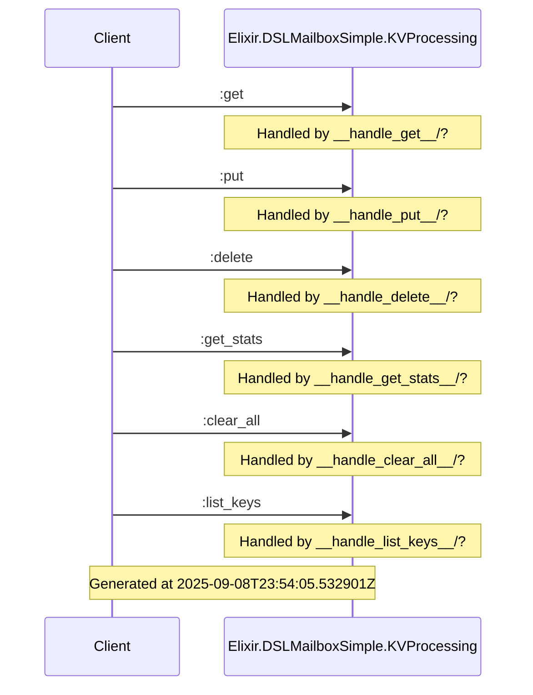

# Engine Communication Diagram

This diagram shows the communication flow for the engine(s).

## Metadata

- Generated at: 2025-09-08T23:54:05.533027Z
- Generated by: EngineSystem.Engine.DiagramGenerator

