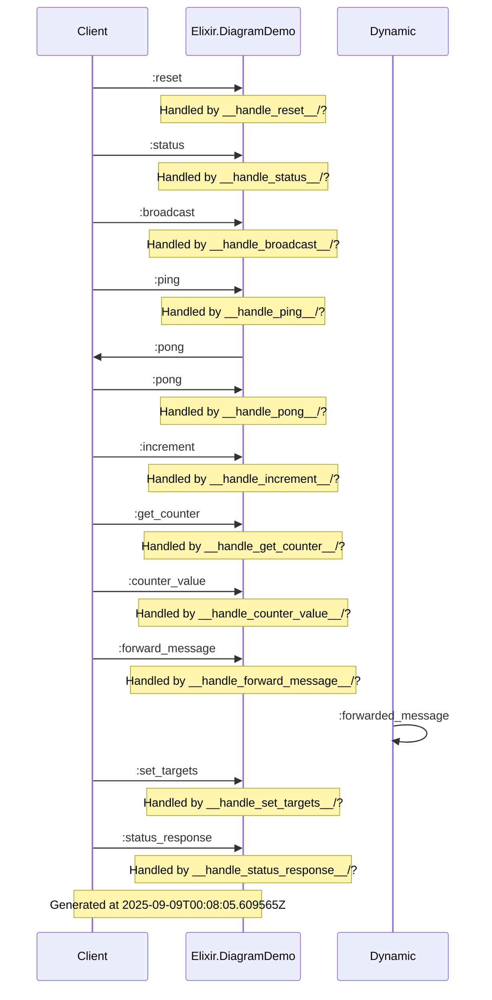

# Engine Communication Diagram

This diagram shows the communication flow for the engine(s).

## Metadata

- Generated at: 2025-09-09T00:08:05.609794Z
- Generated by: EngineSystem.Engine.DiagramGenerator

