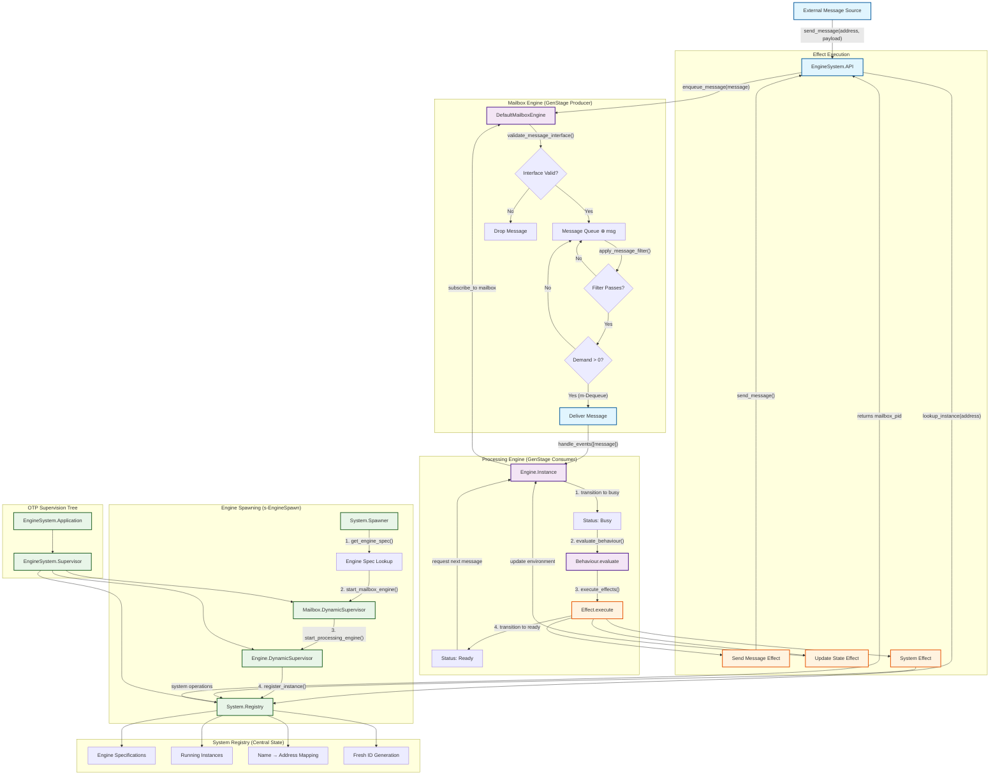

# Operational Semantics Flow

In the diagram,

- 🔵 Blue: Message flow components
- 🟣 Purple: Engine components (mailbox & processing)
- 🟢 Green: System infrastructure components
- 🟠 Orange: Effect execution components

- **Formal Model Compliance**:
  The diagram directly maps to the formal operational semantics:
  - s-EngineSpawn: Engine creation process
  - m-Send/m-Enqueue/m-Dequeue: Message handling operations
  - s-Process: Core processing rule with state transitions
  - Mailbox operations: ⊕ (enqueue) and ⊖ (dequeue) operations

